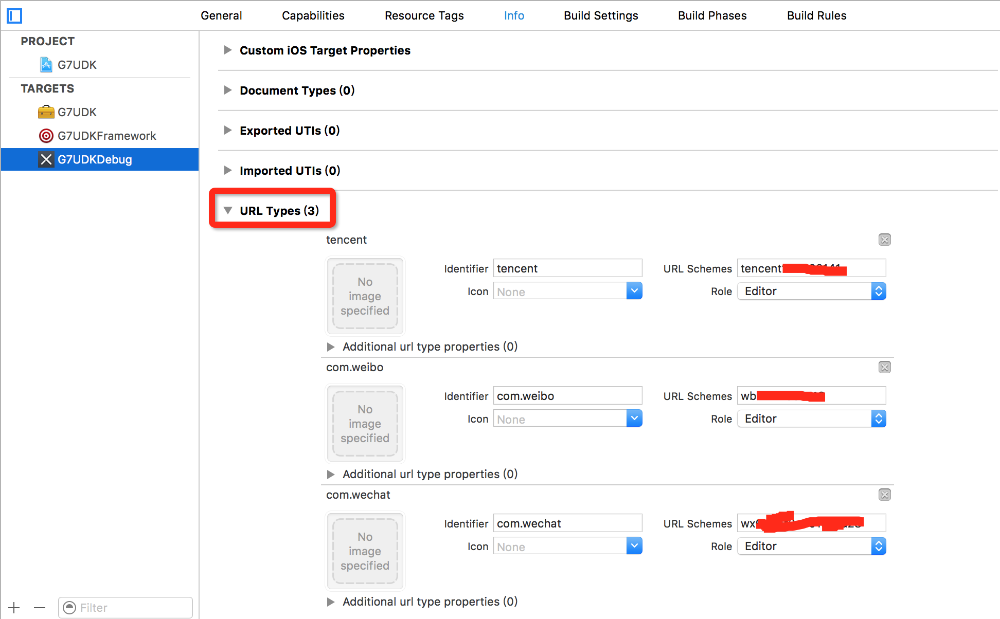
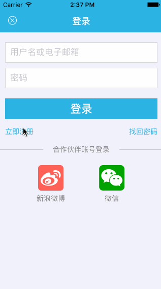
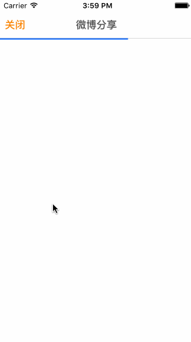

# G7UDK

[](http://cocoapods.org/?q=G7UDK)
 [](https://github.com/gao7ios/G7UDK/blob/master/LICENSE)
 []()
 [](http://weibo.com/1980898711)

搞趣网iOS客户端用户系统SDK，对接搞趣账户登陆， 第三方登录与分享。

## 如何使用


**需要:**

- 操作系统: Mac OS X 10.10.3 及以上版本
- 开发工具: Xcode 7.0 及以上版本
- 支持设备: iPhone/iPod Touch/iPad (iOS 7.0 及以上版本)

**依赖:**

- G7Core.framework 1.1.2.20151223
- G7BLL.framework 1.2.3.151224
- G7Network.framework
- TencentOpenAPI.framework
- SystemConfiguration.framework
- Foundation.framework
- ZipArchive.framework
- CoreLocation.framework
- CoreGraphics.framework
- CoreTelephony.framework
- MessageUI.framework
- MediaPlayer.framework
- CoreTelephony.framework
- libc++.dylib 或 libc++.tbd
- libsqlite3.0.dylib 或 libsqlite3.0.tbd
- libz.dylib 或 libz.tbd
- libconv.dylib 或 libconv.tbd

**项目修改**

- Other Linker Flags 添加 -lstdc++    -ObjC

**注意事项**

- 目前用户系统都是用HTTP请求，支持iOS9需要在 info.plist 文件中增加
如下配置:(信任 HTTP 请求)

```
<dict>
	<key>NSAllowsArbitraryLoads</key>
	<true/>
</dict>
```

- 目前第三方登录和分享需要在iOS9添加白名单才能够跳出应用，需要在info.plist文件中添加如下配置

```
<dict>
  <key>LSApplicationQueriesSchemes</key>
  <array>
    <string>sinaweibo</string>
    <string>sinaweibohd</string>
    <string>sinaweibosso</string>
    <string>sinaweibohdsso</string>
    <string>weibosdk</string>
    <string>weibosdk2.5</string>
    <string>wechat</string>
    <string>weixin</string>
  </array>
</dict>
```

- 在项目TARGET的Info选项中设置URL Types



配置URL Types时候需要注意的是:
- tencent的URL Schemes填写:tencent加上腾讯的appkey
- sinaweibo的URL Schemes填写:wb加上新浪微博的appkey
- wechat的URL Schemes填写:wx加上微信的appkey


**接入**

- 初始化第三方配置信息 (在应用初始化的时候)

```objc

/**
新浪微博
#define SINAOAUTHCONSUMERKEY				@"sinaweibokey"
#define SINAOAUTHCONSUMERSECRET             @"sinaweibosecret"
#define SINAAUTHSSOURL                      @"authssourl"

腾讯
#define QQAUTHCONSUMERKEY				@"qqauthkey"
#define QQAUTHCONSUMERSECRET			@"qqauthsecret"
#define QQAUTHSSOURL                    @"authssourl"

微信
#define WECHATAUTHCONSUMERKEY              @"wechatkey"
#define WECHATAUTHCONSUMERSECRET           @"wechatsecret"
*/

/// 注册新浪微博认证与分享功能
[G7UDK connectSinaWeiboWithAppKey:SINAOAUTHCONSUMERKEY
                        appSecret:SINAOAUTHCONSUMERSECRET
                      redirectUri:SINAAUTHSSOURL
                         bundleid:@"com.g7udk.demo"];

/// 注册微信与微信朋友圈认证与分享功能
[G7UDK connectWeChatWithAppId:WECHATAUTHCONSUMERKEY
                    appSecret:WECHATAUTHCONSUMERSECRET];

/// 注册腾讯QQ认证与分享功能
[G7UDK connectQQWithAppKey:QQAUTHCONSUMERKEY
                 appSecret:QQAUTHCONSUMERSECRET
               redirectUri:QQAUTHSSOURL];

/// 注册腾讯空间分享功能
[G7UDK connectQZoneWithAppId:QQAUTHCONSUMERKEY];

/// 注册邮箱分享功能
[G7UDK connectMail];

/// 注册短信分享功能
[G7UDK connectSMS];

/// 注册复制功能
[G7UDK connectCopy];

```


- 登录与注册

```objc

// 点击弹出登录界面
[[G7UDK sharedInstance] loginWithDelegate:self];

```

* 演示:




- 第三方登录

```objc

// 第三方登录，前往搞趣报道
[[G7UDK sharedInstance] ssoAuthLogin:UDKAccountSSOModeWeibo delegate:self];

// 第三方登录, 前往搞趣报道
[[G7UDK sharedInstance] ssoAuthLogin:UDKAccountSSOModeWeibo delegate:self rootViewController:self];

// 第三方登录，回调自己报道
[[G7UDK sharedInstance] ssoAuth:UDKAccountSSOModeWeibo completeBlock:^(UDKResponseState state, id<IUDKPlatformCredential> credential, UDKErrorInfo *error) {
}];

```

- 第三方分享


```objc

UIImage *image = [UIImage imageNamed:@"test.jpg"];
id<IUDKSCAttachment> attachment = [G7UDK pngImageWithImage:image];
NSMutableDictionary *additionDic = [NSMutableDictionary dictionary];
[additionDic setObject:@"@helios___" forKey:UDKSHARE_TYPE_NUMBER(UDKShareTypeSinaWeibo)];
[additionDic setObject:@"@helios___" forKey:UDKSHARE_TYPE_NUMBER(UDKShareTypeQQSpace)];
id<IUDKSContent> content = [G7UDK content:@"分享内容"
                           defaultContent:@"默认分享内容"
                                    image:attachment
                                    title:@"标题"
                                      url:@"分享URL"
                              description:@"说明"
                                mediaType:UDKPublishContentMediaTypeNews
                       locationCoordinate:nil
                                  groupId:@""
                                 addition:additionDic];

//创建自定义分享列表
NSArray *shareList = [G7UDK customShareListWithType:
                      UDKSHARE_TYPE_NUMBER(UDKShareTypeWeixiSession),
                      UDKSHARE_TYPE_NUMBER(UDKShareTypeWeixiTimeline),
                      UDKSHARE_TYPE_NUMBER(UDKShareTypeSinaWeibo),
                      UDKSHARE_TYPE_NUMBER(UDKShareTypeQQ),
                      UDKSHARE_TYPE_NUMBER(UDKShareTypeQQSpace),
                      UDKSHARE_TYPE_NUMBER(UDKShareTypeMail),
                      UDKSHARE_TYPE_NUMBER(UDKShareTypeSMS),
                      UDKSHARE_TYPE_NUMBER(UDKShareTypeCopy),nil];

[G7UDK showShareList:shareList
             content:content
              result:^(UDKShareType type, UDKResponseState state, id<IUDKErrorInfo> error, BOOL end) {

              }];

```

演示：


